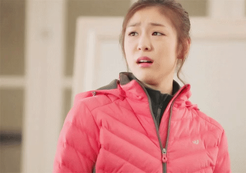

# 1. 반갑다 친구야

## #1

오늘도 퇴근하고 버스를 타는 회사원 곽모군

버스에서 낭만버스 어플 접속해서 대화하는 중...

## #2 (독백 더빙)

(구도가 이와 같음. 표정은 다르게...)

닉네임은 바뀌지만 항상 보던 사람(프로필 눌러서 확인해는 장면 넣기/빼기 고민중) 에게 호감 가짐

- (ㅁ님 또 오셨네, 이 분이랑 타면 말이 잘 통해서 좋다니까)

그 사람에게 술 한잔 하실래요? 하고 권하는데, 상대도 응하고 괜찮은 가게를 알고있다고 같이 내리기로 함

- 
- ㅁ님 술 한잔 하실래요?
- a: 좋네요.
- a: 괜찮은 가게 하나 아는데, 잠실역에서 내려서 같이 가시죠.

## #3

완전히 마주보는 장면이 아님. 비스듬하게 마주보는 구도(중요! 마주볼 경우 게이처럼 보일 수도 있음)

- (내리면서 얼굴을 보며), 어? 너 현규야? 현규 맞지?

- 상대: 오랜만이다 종환아~!

## #4

1. 반갑게 술(물)을 마신다. 
2. 블러 되며 낭만버스 아이콘&로고

# 3. 시인이 되고 싶었어요

## #1

채팅에서 신세한탄하는 종환군 (피로해보이는 얼굴 (표정 안바꾸고 해도 될듯))

"지금 하는 일이 적성에 맞지 않는 것 같아요"

고민을 들어주는 익명의 사내

"가우르 구라님은 어떤사람이 되고 싶으셨어요?"

(종환은 눈을 감는다. 페이드아웃 되면서

검은 화면 속에서 멋있는 글씨체로 시가 한 줄 한 줄 나온다.)

"저는 시인이 되고 싶었어요. 가야할 때가 언제인지를 분명히 알고 가는 이의 뒷모습은 얼마나 아름다운가. 봄 한 철 격정을 인내한 나의 사랑은 지고 있다. 분분한 낙화...

한 잔은 떠나버린 너를 위하여, 한잔은 너와나의 영원한 사랑을 위하여, 또 한잔은 이미 초라해진 나를 위하여, 그리고 마지막 한 잔은 미리 알고 정하신 하나님을 위하여..."

(페이드인 되며 종환은 눈을 뜬다.

채팅방엔 그가 쓴 시가 올라가 있다.)

상대방이 "시 잘 쓰시네요. 작가하셔도 되겠어요."

## #2

내렸는데 양복입은 사람이 같이 내리면서 알아봄

"가우르 구라님 맞으시죠?"

명함을 건네는데, 낭만출판사 사장임.

### **"시인, 해보자구요!"**

# ~~*2. 형이 왜 거기서 나와...?* 폐기!~~

## *#1*

1. *스트레스 받는 출근길, 오늘도 낭만버스에서 채팅을 하는 종환군*

## *#2*

1. *처음 보는 사람의 채팅이 마음에 안듦*
   - **
   - *저 사람은 뭐하는 사람인데 자꾸 힘을 내래...*
2. *상대도 마찬가지였음*
   - **
   - *저렇게 부정적이어서야 다른 사람에게 민폐 아닌가..*
3. *앱 내 전광판에서 내리는 정류장이 같은 것을 둘 다 봄*
   - **
   - *뭐야, 같은데서 내리잖아?*
   - *얼굴이나 한 번 봐야겠네.*

## *#3*

1. *내리며 서로 얼굴을 확인하는데 종환군은 일주일 전 입사한 신입, 상대는 같은 부서 팀장님임*

   - **

   - *(!!! 놀라며) 팀장님! 안녕하세요?*

   - *(당황하지만 바로 표정을 바로잡으며) 종환씨, 안녕하세요.*

**

*(버스 뒤쪽 대각선에서 내리는 두 사람 촬영)*

*잠깐의 침묵과 함께 내리는 두 사람. 버스는 두 사람만을 내보내고 출발한다.*
*(촬영 때 조건이 안 될 경우, 다른 사람들은 무관심하게 갈 길을 가지만, 종환군은 미묘하게 눈치를 본다.)*

- *팀장: ...가우르 구라?*

- **

- *종환: (복잡해진 표정) 네?*

- **

- *팀장: (웃으며) 오늘도 힘 내시죠.*

- *종환: 네...*

- *걸어가는 두 사람. 블러 되며 낭만버스 로고와 아이콘*

  **

